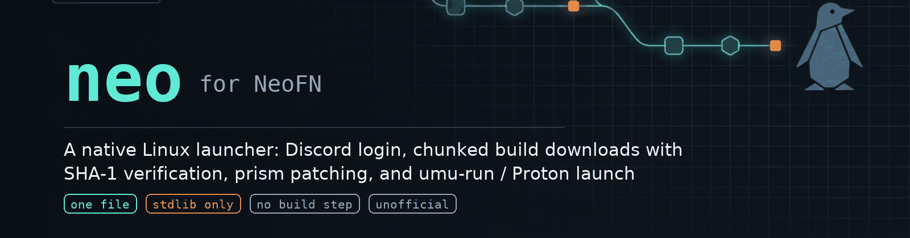

<p align="center">
  <a href="https://github.com/Agentpuggles/Neo-Linux/actions/workflows/ci.yml"></a>
  <a href="LICENSE"></a>
  <a href="#requirements"></a>
  <a href="CONTRIBUTING.md#ground-rules"></a>
  <a href="https://github.com/astral-sh/ruff"></a>
  <a href="#status"></a>
</p>

**A native Linux launcher for [NeoFN](https://neofn.dev)** — Discord login, chunked
build downloads with hash verification, patched-client management and game launch, in
one stdlib-only Python file. Nothing to build, nothing to `pip install`.

The game itself runs through
[umu-launcher](https://github.com/Open-Wine-Components/umu-launcher) / Proton. The
launcher needs no Wine of its own.

```
login → pick build → manifest → parallel chunk download → zlib + SHA-1 verify
      → assemble → per-file verify → prism-patched exe + 2 exchange codes → umu-run
```

> **Unofficial, interoperability-focused tool.** Not affiliated with or endorsed by
> NeoFN or Epic Games. It talks only to NeoFN's own public services using the
> credentials of their official launcher (extracted for compatibility, the same
> approach [legendary](https://github.com/derrod/legendary) takes). No game assets are
> included or redistributed. Using an unofficial launcher on a live service is a
> judgement call each user makes — see [SECURITY.md](SECURITY.md).

## Contents

| Section | What it covers |
| --- | --- |
| [Status](#status) | what works, what is still gated on the service |
| [Requirements](#requirements) | Python, umu-run, Wine prefix |
| [Install](#install) | clone + one `install` command |
| [Quick start](#quick-start) | first run to playing, six commands |
| [Usage](#usage) | every command, flag by flag |
| [Configuration](#configuration) | paths, settings, environment, disk usage |
| [How it works](#how-it-works) | the pipeline, and where the protocol is documented |
| [Repository layout](#repository-layout) | what lives where |
| [Development](#development) | lint, tests, `make` targets |
| [Documentation](#documentation) | protocol reference, engineering notes, changelog |
| [Troubleshooting](#troubleshooting) | symptoms and fixes |
| [Contributing](#contributing) | issues, pull requests, security reports |
| [Acknowledgements](#acknowledgements) | the projects this stands on, and how this was written |
| [License](#license) | MIT |

## Status

Current release: **v0.5.3**.

| Feature | State |
| --- | --- |
| Discord OAuth login (`neolauncher://` handler + manual fallback) | ✅ |
| Session refresh, display-name setup, ban / access status | ✅ |
| Build catalog + Epic BuildPatchServices manifest parsing | ✅ |
| Parallel chunk downloader (16+ workers, resumable, SHA-1 per chunk **and** per file) | ✅ 411 files / 62,032 chunks / 61.9 GiB on 10.40 |
| Install / verify / reinstall with a relocatable cache | ✅ |
| Targeted repair — only broken files re-fetched (`neo verify --repair`) | ✅ |
| Import an existing build folder, no re-download (`neo import`) | ✅ |
| Access watch with desktop notification (`neo status --watch`) | ✅ |
| Launcher news in the terminal (`neo news`) | ✅ |
| Install-time disk preflight (cache + target checked before bytes move) | ✅ |
| Friends roster + presence over XMPP (`neo friends`) | ✅ |
| Prism asset management (sha256-verified, auto-updated) | ✅ |
| Launch via umu-run (exact Windows-launcher command line) | ✅ boots, auto-logs in |
| Playing | ⏳ waits on NeoFN granting account access + the `PLAY` entitlement (private testing as of v0.3.0) |

✅ session live-validated 2026-08-30 against production (SASL PLAIN accepted, official bind resource accepted); roster/presence rendering confirmed against a scripted server and awaiting observation with a non-empty friends list.
| Store / early-access entitlement visibility (`neo status`) | ✅ |

## Requirements

| | |
| --- | --- |
| **Python** | ≥ 3.9, stdlib only — nothing to `pip install` |
| **umu-run** | [`Open-Wine-Components/umu-launcher`](https://github.com/Open-Wine-Components/umu-launcher) plus any modern Proton |
| **Disk** | the compressed build *and* the extracted build at peak — ~62 GiB → ~124 GiB for 10.40 |
| **Wine prefix** | created on first run if you don't set `WINEPREFIX` — but do set it, see [Configuration](#configuration) |

## Install

```sh
git clone https://github.com/Agentpuggles/Neo-Linux.git
install -Dm755 Neo-Linux/neo ~/.local/bin/neo
neo --version
```

`neo` is a single executable file; `install` is all the setup it needs. Make sure
`~/.local/bin` is on your `PATH`, or call it by path.

To run it straight from the checkout instead:

```sh
python3 ./neo --help
```

## Quick start

```sh
neo login                             # 1. Discord in your browser; callback is automatic
neo setup YourName                    # 2. pick a display name (first run only)
neo status                            # 3. service, bans, play access, players online

neo install                           # 4. the live build (tens of GB)
neo verify                            # 5. re-hash everything against the manifest

export WINEPREFIX=~/prefixes/neofn    # 6. give the game its own prefix
neo launch
```

Interrupted installs resume — re-run the same command and cached chunks are reused.

## Usage

```
neo <command> [options]

  account   login · whoami · setup · logout · status · news · friends
  game      list · install · import · verify · uninstall · launch
  system    cache · log · config               (see Configuration)
```

Run `neo <command> --help` for a command's own options.

### Account

| Command | What it does |
| --- | --- |
| `neo login` | Opens the Discord OAuth challenge in your browser and registers the `neolauncher://` handler, so the callback is handled automatically. Fallbacks: `neo login --callback '<url>'` with the full callback URL, or `neo login --code <CODE>`. |
| `neo whoami` | Display name, account id and email for the current session. |
| `neo setup [name]` | With no name: shows first-run setup status. With a name: checks availability, then sets the display name. |
| `neo logout` | Drops the stored session (`auth.json` is emptied, not deleted). |
| `neo status` | Lightswitch service status, ban status (both services), `fortniteAccess`, store entitlements, players online. `--watch` keeps polling until access is granted, then fires a desktop notification — the Windows launcher checks once per start and never re-checks, so this beats it to the punch. `--interval N` sets the period (min 10 s). |
| `neo news` | Launcher news from the content service (`--json` for the raw payload). |
| `neo friends` | Roster with display names and live presence, speaking the official client's own XMPP-over-websocket protocol (protocol.md §12): SASL PLAIN with the account id + access token, official bind resource. `--wait N` presence window, `--verbose` prints the raw stanzas. Falls back to the friends REST API when the websocket is unreachable. `NEO_XMPP` overrides the endpoint. |

### Game

| Command | What it does |
| --- | --- |
| `neo list` | Every build in the catalog with size, release date and the `[LIVE]` marker. |
| `neo install [version]` | Downloads and assembles a build. `version` is a substring such as `10.40`, or `live` (the default). Options: `-d DIR`, `-j WORKERS`, `--keep-cache`. Free space on both the cache and the target volume is checked first (engineering note 9); `--force` skips that check. |
| `neo import <path> <version>` | Registers a build folder that already exists on disk (must contain `FortniteGame/` and `Engine/`) — no 62 GB re-download. Fetches the manifest so `verify` works, and marks the install as imported. |
| `neo verify [version]` | Re-hashes every installed file against the stored manifest. `--repair` re-fetches only the chunks the broken files need and rebuilds just those files — a full reinstall is never needed for a few bad files. |
| `neo uninstall [version]` | Removes an install: deletes the build folder (only if it still carries neo's `.neo-manifest.json`) and drops the state entry. Prompts unless `--yes`. |
| `neo launch [version]` | Checks the gates (lightswitch, bans), refreshes prism assets, mints two exchange codes and runs the game through umu-run. Options: `--dry-run` (print the command line and stop), `--proton PROTON`. Extra UE4 arguments go last: `neo launch 10.40 -windowed` (options like `--dry-run` must come before them). |

`version` defaults to the newest installed build (highest `CL-` number) for `verify`,
`uninstall` and `launch`.

### System

| Command | What it does |
| --- | --- |
| `neo cache [stats\|clear]` | Size of the chunk/manifest caches, and cleanup. `clear` drops cached chunks (manifests stay unless `--all`). |
| `neo log [-f] [-p PATH]` | Prints the game's `FortniteGame.log` from the Wine prefix (auto-located via `WINEPREFIX`), with login/entitlement/error lines highlighted. `-f` tails it live — the fastest way to watch the `PLAY` entitlement flip. |

## Configuration

### The `config` command

| Command | What it does |
| --- | --- |
| `neo config` | Print every setting and the config file path. |
| `neo config <key>` | Print one setting. |
| `neo config <key> <value>` | Set a setting. Keys: `install_root`, `cache_dir`, `workers`. |

### Files

| Path | Contents |
| --- | --- |
| `~/.local/share/neo/auth.json` | Session tokens (mode `0600`) |
| `~/.local/share/neo/state.json` | Installed builds → paths |
| `~/.local/share/neo/prism/` | Prism-patched client binaries, sha256-checked on every launch |
| `~/.local/share/neo/cache/` | Chunk and manifest cache |
| `~/.config/neo/config.json` | Settings |

### Settings

| Key | Default | Also settable via |
| --- | --- | --- |
| `install_root` | `~/Games/Neo` | `neo install -d DIR` |
| `cache_dir` | `~/.local/share/neo/cache` | `NEO_CACHE` |
| `workers` | `16` | `neo install -j N` |

### Environment

| Variable | Meaning |
| --- | --- |
| `NEO_HOME` | Override the data directory |
| `NEO_CACHE` | Override the cache directory |
| `NEO_UMU` | umu-run command to invoke (default `umu-run`) |
| `WINEPREFIX` | Game prefix, honoured by umu-run — **set it**, otherwise umu uses `~/.wine` |

### Disk usage

Peak during an install ≈ compressed build size (cache) + full build size (install
directory), both checked before the download starts. The cache is purged on success
unless you pass `--keep-cache`, which keeps it for offline repair at the cost of
roughly one build's worth of disk. `neo cache stats` shows what is sitting there;
`neo cache clear` reclaims it.

## How it works

```
 1. login        Discord OAuth → neolauncher:// callback → access + refresh token
 2. catalog      /launcher/api/public/builds → pick the live build
 3. manifest     <dist>/<manifestPath> → Epic JSON manifest (~20 MB)
 4. download     chunk GUIDs → N workers → Cloudflare R2, retries + backoff
 5. verify       per chunk: header SHA-1 vs ChunkShaList; per file: SHA-1 vs FileHash
 6. assemble     concatenate chunk slices, apply +x and symlinks, atomic rename
 7. patch        prism assets → patched FortniteClient-Win64-Shipping.exe
 8. launch       two exchange codes → umu-run → Proton → DX11
```

Every endpoint, the OAuth quirks (case-sensitive provider route, nonstandard
`authorization_code` field), the manifest's fixed-width decimal numerics, the chunk URL
scheme and on-disk format, the prism assets and the exact launch command line — with the
pitfalls of running it through Wine — are written up in
[docs/protocol.md](docs/protocol.md).

## Repository layout

```
neo                          the launcher: one file, ~800 lines, stdlib only
docs/
  protocol.md                the wire format, validated against production
  engineering-notes.md       every dead end, diagnosis and fix
  assets/                    README banner and social-preview image
tests/                       offline unit tests (stdlib unittest, no network)
.github/
  workflows/ci.yml           lint + Python 3.9→3.14 test matrix + docs checks
  ISSUE_TEMPLATE/            bug report and feature-request forms
  PULL_REQUEST_TEMPLATE.md   what a PR must show
  dependabot.yml             keeps the actions current
CHANGELOG.md                 release history and known issues
CONTRIBUTING.md              how to change this safely
SECURITY.md                  private reporting and scope
Makefile  ruff.toml          the two commands CI runs, locally
```

## Development

```sh
make check     # ruff, the offline test suite, and a CLI smoke run — what CI runs
make test      # python -m unittest discover -s tests -t .
make lint-fix  # ruff, applying safe fixes
make install   # install -Dm755 into ~/.local/bin
```

The suite is offline: it points `NEO_HOME`, `NEO_CACHE` and `XDG_CONFIG_HOME` at a
temporary directory and stubs the HTTP layer, so it never touches your account, your
cache or the network. What it cannot do is prove a live install works — `neo install`,
`neo verify` and `neo launch --dry-run` on real hardware stay part of the pre-release
checklist in [CONTRIBUTING.md](CONTRIBUTING.md#testing).

## Documentation

| Document | What's in it |
| --- | --- |
| [docs/protocol.md](docs/protocol.md) | The wire protocol: endpoints, auth quirks, manifest format, chunk URLs and file layout, prism, the launch recipe. Validated live against production. |
| [docs/engineering-notes.md](docs/engineering-notes.md) | Every significant bug and dead end from building this, with the diagnosis that resolved it — including the ones that were our own fault. |
| [CHANGELOG.md](CHANGELOG.md) | Release history and known issues. |
| [CONTRIBUTING.md](CONTRIBUTING.md) | Design constraints, dev setup, testing, PR and release conventions. |
| [SECURITY.md](SECURITY.md) | What to report, how, privately, and what the in-tree OAuth client credentials are. |

## Troubleshooting

| Symptom | Fix |
| --- | --- |
| Login callback didn't fire | Copy the whole `neolauncher://callback/auth?code=…` URL from the address bar and pass it to `neo login --callback '<url>'`. Codes are single-use and expire quickly — when in doubt, `neo login` again. |
| CDN returns 403 | R2 rejects some default user agents; `neo` sends its own. If you're behind a proxy or VPN, try without it. |
| Chunk downloads fail with 404 | The CDN edge transiently 404s objects that exist; `neo` retries with backoff. A hard failure names the chunk GUID. |
| Game shows an email / password screen | The login itself usually succeeded — check `neo status` for play access. Log: `<prefix>/drive_c/users/<user>/AppData/Local/FortniteGame/Saved/Logs/FortniteGame.log`. |
| `Failed to open descriptor file` | A `-basedir` quoting problem. `neo` already passes it bare; don't add quotes yourself. |
| Extra UE4 command-line arguments | The `extra` positional exists but argparse rejects flag-shaped arguments after the subcommand, so extras don't reach the game yet. `--dry-run` and `--proton` work. |
| Install filled the disk mid-download | Point the cache somewhere big: `neo config cache_dir /mnt/data/neo-cache`, or `NEO_CACHE=/mnt/data/neo-cache neo install`. Resume the same command. |

## Contributing

Issues and pull requests are welcome — see
[CONTRIBUTING.md](CONTRIBUTING.md) for the constraints, the test expectations and the
release checklist. The most useful contribution is usually a verified observation about
the service, written up as a protocol note.

- [New issue forms](https://github.com/Agentpuggles/Neo-Linux/issues/new/choose) ·
  [existing issues](https://github.com/Agentpuggles/Neo-Linux/issues) ·
  [CI](https://github.com/Agentpuggles/Neo-Linux/actions/workflows/ci.yml)
- Security problems: [SECURITY.md](SECURITY.md), reported privately.
- Behaviour here is governed by [CODE_OF_CONDUCT.md](CODE_OF_CONDUCT.md).

## Acknowledgements

| Project | What it provided |
| --- | --- |
| [umu-launcher](https://github.com/Open-Wine-Components/umu-launcher) | the runner that actually starts the game under Proton |
| [legendary](https://github.com/derrod/legendary) | the precedent for using Epic's own public client credentials for interop |
| Epic's `BuildPatchServices` | the chunk and manifest formats this launcher reads, decompiled where the format was ambiguous |
| [Cloudflare R2](https://developers.cloudflare.com/r2/) | the CDN behaviour (`403` on default user agents, transient `404`s) documented in [docs/protocol.md](docs/protocol.md#63-cdn-gotchas-cloudflare-r2) |
| [ruff](https://docs.astral.sh/ruff/) | the single dev tool this repo needs |

**Authorship.** `neo` itself, and the rest of this repository — the protocol notes, the
engineering log, the tests, the CI, this README — were written with substantial
assistance from AI coding agents, directed by a human who ran every live install,
supplied the Windows binaries that had to be decompiled, and decided what counted as
working. The agents are tools; the copyright and the judgement calls are
[Agentpuggles](https://github.com/Agentpuggles).

Fortnite is a trademark of Epic Games, Inc. NeoFN is not affiliated with this project.

## License

[MIT](LICENSE) — © 2026 Agentpuggles. The launcher is not affiliated with NeoFN or Epic
Games. No game assets, client binaries or account data are distributed with it; anything
`neo` downloads stays in your own data directory.
