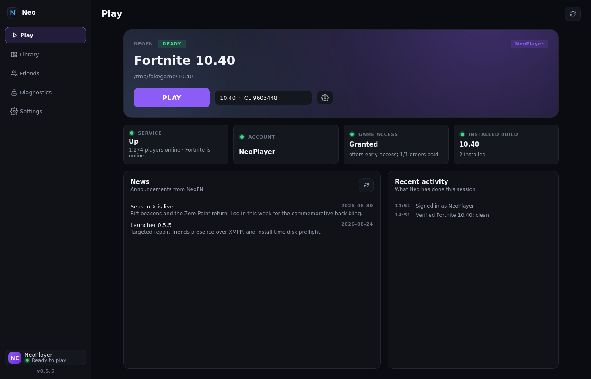

**Play [NeoFN](https://neofn.dev) on Linux, without memorising terminal commands.**
Neo opens a native desktop app where you can sign in with Discord, download a
Fortnite build and press **Play**. The game runs through
[umu-launcher](https://github.com/Open-Wine-Components/umu-launcher) and Proton;
the launcher itself does not need Wine.

> **Unofficial:** not affiliated with NeoFN or Epic Games. No game files are
> bundled. You use your own NeoFN account and their services; see the
> [security and account-risk notes](SECURITY.md).



## Requirements

| You need | Details |
| --- | --- |
| **Linux desktop** | Wayland or X11, with working graphics drivers |
| **Python / Qt** | Bundled in the AppImage. Source installs need Python ≥ 3.9 and PySide6; the optional CLI needs host Python ≥ 3.9. |
| **umu-launcher** | Provides `umu-run` to run the game through Proton; follow its [installation guide](https://github.com/Open-Wine-Components/umu-launcher#installation) |
| **Free disk space** | About **124 GiB at peak** for build 10.40 (download cache + installed game), plus room for Proton and its runtime |

## Install

### AppImage

A release AppImage bundles the desktop app, Python and Qt. Download it from
[Releases](https://github.com/Agentpuggles/Neo-Linux/releases), mark it executable
in your file manager and open it. You still need **umu-launcher** to play.
See [AppImage setup](docs/appimage.md#download-and-run) for checksums and FUSE fixes.
Until the first AppImage is published, use a workflow test build or install from source.

### From source

You will need Git and Make as well as Python. Install PySide6 using **one** command
for your distro:

| Distro | Command |
| --- | --- |
| Arch / CachyOS | `sudo pacman -S pyside6` |
| Fedora | `sudo dnf install python3-pyside6` |
| Debian / Ubuntu / Mint | `sudo apt install python3-pyside6.qtwidgets` |
| openSUSE | `sudo zypper install python3-pyside6` |

Package unavailable? Use the [virtualenv setup](docs/desktop-setup.md#virtualenv-setup)
instead — no system-wide `pip install` needed.

Then install Neo for your user account (**no sudo**):

```sh
git clone https://github.com/Agentpuggles/Neo-Linux.git
cd Neo-Linux
make install
~/.local/bin/neo-gui
```

`make install` includes the GUI, its backend, app-menu entry and icon. Open
**Neo** from your application menu after installation — no terminal is needed
for everyday use.

On first launch, Neo offers **Install CLI (recommended)** or **Not now**. The
command-line tool is **highly recommended for troubleshooting and doing tasks
manually**, but entirely optional. You can install it later from
**Settings → Command-line tool**; skipping it does not limit the GUI.

## Start playing

1. **Sign in with Discord** and approve the request in your browser. Choose a
   display name if Neo asks for one.
2. **Install the live build.** Pick a folder on a drive with enough space. Already
   have the game files? Use **Library → Import folder** instead of downloading them again.
3. **Press Play.** The first launch may take longer while umu prepares Proton and
   its runtime.

Downloads resume after an interruption: start the same install again. If files
are missing or damaged, use **Library → Verify & repair** rather than reinstalling.

In **Settings**, you can change the download location, Proton build, launch
arguments and theme. **Library → Game modifiers** has gameplay modifiers such as
Edit On Release, Instant Reset and Disable Pre-Edit. **Friends** shows your roster;
**Diagnostics** has logs and a redacted report for troubleshooting.

## Status

Current release: **v0.6.0**. Full matches were played on Linux with this launcher
on **2026-09-05**, using umu/Proton. Compatibility still depends on NeoFN's services
and your system. See the [changelog and known issues](CHANGELOG.md).

## Troubleshooting

| Problem | Try this |
| --- | --- |
| The browser does not return to Neo | Paste the full `neolauncher://…` callback URL into the sign-in dialog. Start sign-in again if the code expired. |
| A download runs out of space | Choose a larger drive for **Download cache** or **Install location** in Settings, then retry. |
| The game will not start | Check that `umu-run` is installed, then open **Diagnostics**. For an “unimplemented function” error, try **GE-Proton** in Settings → Launch. |
| Neo will not open | Run `~/.local/bin/neo-gui` in a terminal to see the error, then check the [setup and startup fixes](docs/troubleshooting.md#desktop-startup). |

For more fixes, see [Troubleshooting](docs/troubleshooting.md). Still stuck?
[Open an issue](https://github.com/Agentpuggles/Neo-Linux/issues/new/choose) with your
distro, Neo version and a reviewed diagnostics report. **Never post session tokens
or `auth.json`.** Report security issues [privately](SECURITY.md).

## Prefer the terminal?

Once you install the optional CLI, all existing commands work without PySide6
or a graphical session:

```sh
neo --help                 # list terminal commands; does not open the GUI
neo status                 # service and account status
neo verify --repair        # repair the newest installed build
```

For a terminal-only installation, use `make install-cli` instead of `make install`.
The GUI and CLI share your account, installs and settings. With the CLI installed,
`neo` without arguments opens the GUI when it is available.

## More information

| Guide | What it covers |
| --- | --- |
| [AppImage](docs/appimage.md) | Downloading, building, updates and release checks |
| [Desktop setup](docs/desktop-setup.md) | Virtualenv alternative, updates, uninstalling and packaging |
| [CLI reference](docs/cli-reference.md) | All commands, configuration, file paths and environment variables |
| [Contributing](CONTRIBUTING.md) | Development setup, tests and pull requests |
| [GUI architecture](docs/gui-architecture.md) | How the desktop app uses the shared backend |
| [Protocol reference](docs/protocol.md) | Authentication, downloads and the launch protocol |
| [Engineering notes](docs/engineering-notes.md) | Diagnoses and lessons from building Neo |

## Acknowledgements

Built on [umu-launcher](https://github.com/Open-Wine-Components/umu-launcher),
Proton/Wine, Qt/PySide6 and Epic's BuildPatchServices formats, with interoperability
precedent from [legendary](https://github.com/derrod/legendary) and linting by
[ruff](https://docs.astral.sh/ruff/).

This project was written with substantial AI assistance under
[Agentpuggles](https://github.com/Agentpuggles)' direction and live testing.
Human maintainers make the decisions and remain responsible for the project.

## License

[MIT](LICENSE) · © 2026 Agentpuggles. Fortnite is a trademark of Epic Games, Inc.
Community participation follows our [Code of Conduct](CODE_OF_CONDUCT.md).
